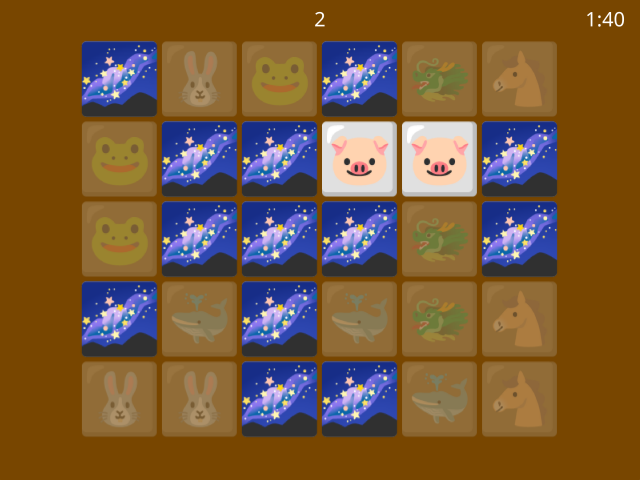

# engine.py

## Simple App/Game Engine for Python Qt

Single-file wrapper for Qt for educational purposes.


### Features
- single window apps or games
- graphics and animations (emojis, PNG, JPEG, GIF, ...)
- sound and music (WAV)
- mouse and keyboard (WASD) control
- popup input forms

### Requirements
- Python 3.5+
- Qt 5.12+ (PyQt5, PySide2) or Qt 6 (PyQt6, PySide6)

Put `engine.py` in apps directory or Python's path

On Linux, you can start the files like this:

`PYTHONPATH=. python3 games/game-memory3.py`



## Tutorial

Hello world in engine.py:

```python
from engine import App

app = App()
app.text = "Hello, world!"
app.exec()
```

Ping-Pong animation:

```python
from engine import App, Emoji

def ping():
    if ball.x > 600:
        ball.vx = -5
        app.frame = pong

def pong():
    if ball.x < 10:
        ball.vx = 5
        app.frame = ping

app = App()

ball = Emoji('softball')
ball.center_in(app.area)
ball.vx = 5
app.show(ball)

app.frame = ping
app.exec()
```

More examples provided in the repository.
